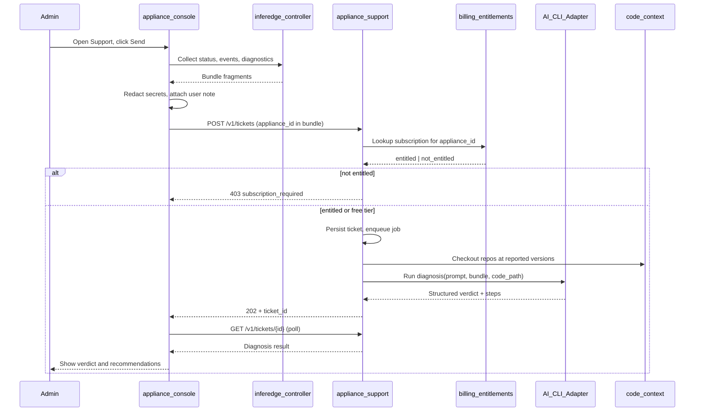

# Appliance Support Service — Design

Hosted support service that receives outbound diagnostic bundles from appliance-console, runs diagnosis through a pluggable AI CLI adapter with backend code context, and returns actionable guidance (bug vs operator-fixable).

Coordinated changes span three repos:

- [`appliance-support/`](../appliance-support/) — hosted API, entitlement checks, ticket store, AI adapter
- [`appliance-console/`](../appliance-console/) — Support UI, bundle assembly, outbound push
- [`inferedge-phase1/`](../inferedge-phase1/) — `GET /support/diagnostics` for container logs + build metadata

---

## Problem

Appliance admins hit operational issues (degraded state, failed reconciles, cluster misconfiguration) but lack tooling to distinguish **product bugs** from **fixable operator mistakes**. Today the console exposes fragments of diagnostics (`events`, `last_error`, `actual.log_snippet` via `GET /api/status`) but there is no way to send a structured report to vendor support or get AI-assisted triage.

## Goals

- New **Support** section in appliance-console with a one-click **Send diagnostic report** action.
- Appliance **pushes** (outbound HTTPS) a redacted, versioned diagnostic bundle to a hosted support API.
- Support service invokes a **pluggable AI CLI adapter** (custom interface; concrete CLI chosen later) with access to backend source at the reported software version.
- Response classifies the issue as **likely bug** vs **operator-actionable**, with clear next steps.
- No technology leakage in console UI (consistent with appliance-console design principles).

## Non-goals (v1)

- Inbound connections into customer networks.
- Real-time chat / multi-turn support threads (defer to Phase 3).
- Automatic bug filing in GitHub (defer to Phase 4).
- Sending raw secrets, HF tokens, or full config exports unredacted.
- Per-appliance support API tokens provisioned on the device.

---

## Architecture



### Repos and ownership

| Repo | Role |
|------|------|
| `appliance-support` | Hosted support API, entitlement integration, ticket store, AI CLI adapter, code-context manager |
| `appliance-console` | Support UI, bundle assembly, outbound push to support API |
| `inferedge-phase1` | `GET /support/diagnostics` for container logs + build metadata |

Management traffic stays as-is (Traefik → console → local controller). Support traffic is a **separate outbound** HTTPS call from the console server to the hosted support service.

---

## Entitlement and billing

Support is a **billable, opt-in service**. Each appliance already has a unique `appliance_id` in its config (generated at billing/provisioning time). The support service does **not** rely on a secret token stored on the appliance.

### Entitlement source (yet-to-define)

The support service reads from a **billing/subscription database** (schema and ownership TBD — likely shared with the existing billing platform). At minimum:

| Field | Purpose |
|-------|---------|
| `appliance_id` | Unique appliance identifier (matches `config.appliance_id`) |
| `customer_id` | Owning customer account |
| `support_entitled` | Whether support is active for this appliance |
| `support_tier` | e.g. `paid`, `trial`, `free` |
| `expires_at` | Optional subscription end date |

### Entitlement rules

Support is provided when **any** of:

1. Customer has an active **paid support subscription** for this `appliance_id`.
2. Appliance is on a **free/trial tier** where support is included.
3. Vendor has globally enabled **free support** (feature flag on support service).

Otherwise the service returns `403` with `subscription_required` and the console shows a clear upgrade message — no diagnosis is run.

### Console-side behaviour

- On Support page load, call `GET /v1/entitlement/{appliance_id}` on the support service to show enabled/disabled state before the admin composes a report.
- On submit, the support service re-checks entitlement (do not trust client-only preflight).
- No `SUPPORT_API_TOKEN` on the appliance. Only `SUPPORT_SERVICE_URL` is required (server-side env on console container).

### Ticket access after submit

`ticket_id` (opaque UUID) acts as a **capability token** for polling `GET /v1/tickets/{id}` — the appliance does not need stored credentials. Optional future hardening: bind ticket to `appliance_id` and reject mismatched polls.

### Dev / mock mode

- Local compose uses a stub entitlement backend (all appliances entitled, or fixture-driven deny list).
- Console mock mode simulates entitled and not-entitled paths without a live billing DB.

---

## Diagnostic bundle schema

Versioned JSON schema in `schemas/diagnostic-bundle.v1.json`.

```json
{
  "bundle_version": 1,
  "appliance_id": "forge-demo-001",
  "submitted_at": "2026-07-07T12:00:00Z",
  "software": {
    "console_version": "git-sha-or-semver",
    "controller_version": "git-sha-or-semver",
    "support_client_version": "1.0.0"
  },
  "topology": {
    "serving_mode": "distributed",
    "role": "coordinator",
    "node_count": 3,
    "local_node_id": "node-1"
  },
  "health": {
    "state": "DEGRADED",
    "last_error": "...",
    "actual": { "health": "...", "exit_code": 1, "log_snippet": "..." }
  },
  "events": [],
  "deployments_summary": [],
  "nodes_summary": [],
  "user_note": "Model won't start after head migration",
  "attachments": {
    "controller_logs_tail": "...",
    "container_logs_tail": { "vllm": "...", "ray": "..." }
  }
}
```

### Collection sources (console-side)

| Data | Source today | Gap |
|------|--------------|-----|
| Status, events, `actual` | `api.status()` → controller `GET /status` | None |
| `appliance_id` | `status.config.appliance_id` | None |
| Config topology | `status.config` | Redact `hf_token`, mask `api_token_set` only |
| Nodes / deployments | `/api/nodes`, `/api/deployments` | Summarize, strip secrets |
| Container log tails | Not exposed | Add controller `GET /support/diagnostics` |
| Build versions | Not exposed | Add `version` block to `/health` or diagnostics |

### Redaction rules (`appliance-console/lib/support/redact.ts`)

- Strip `hf_token`, bearer tokens, SMB/S3 credentials from any nested field.
- Replace IP addresses with optional masking (configurable; default: keep private RFC1918, redact public).
- Truncate log tails (e.g. last 200 lines / 64 KiB per source).
- Never include `conf.json` export wholesale.

---

## appliance-support service design

### Tech stack

- **Python 3.12 + FastAPI** — aligns with inferedge controller patterns.
- **SQLite or Postgres** for ticket persistence.
- **In-process queue** for async diagnosis jobs in v1 (`BackgroundTasks`); Redis later if needed.
- **Docker** deployment with read-only mounts for cloned source trees.

### Directory layout

```
appliance-support/
  DESIGN.md
  README.md
  schemas/
    diagnostic-bundle.v1.json
    diagnosis-result.v1.json
  src/
    main.py
    entitlement.py          # Billing DB adapter + stub for dev
    tickets.py
    redact.py
    jobs/diagnose.py
    ai/
      adapter.py
      stub.py
      registry.py
    code_context/
      manager.py
  tests/
  Dockerfile
  compose.yml
```

### API contract

| Endpoint | Auth | Purpose |
|----------|------|---------|
| `GET /v1/entitlement/{appliance_id}` | Public | `{ entitled, tier?, message? }` for console preflight |
| `POST /v1/tickets` | Public (entitlement gate) | Accept bundle; verify `appliance_id` entitlement; return `{ ticket_id, status }` or `403` |
| `GET /v1/tickets/{id}` | Ticket ID (capability) | Poll `{ status, diagnosis? }` |
| `GET /v1/tickets/{id}/diagnosis` | Ticket ID | Full result when `status=complete` |
| `GET /health` | Public | Liveness |

**Ticket state machine:** `queued` → `diagnosing` → `complete` | `failed` | `denied` (entitlement failed at submit — no ticket created)

### AI CLI adapter (pluggable)

```python
class AICliAdapter(Protocol):
    async def diagnose(
        self,
        *,
        bundle: DiagnosticBundle,
        code_roots: list[Path],
        prompt_template: str,
    ) -> DiagnosisResult: ...
```

`DiagnosisResult` (`schemas/diagnosis-result.v1.json`):

- `verdict`: `likely_bug` | `operator_actionable` | `insufficient_data` | `unknown`
- `summary`: plain-language explanation (admin-facing)
- `confidence`: `low` | `medium` | `high`
- `recommended_actions`: ordered list of steps
- `engineering_notes`: optional internal detail (bug hypothesis, file/line hints)
- `evidence`: citations to bundle fields and code paths

**Stub adapter (Phase 1):** rule-based verdicts from `state`, `last_error`, `exit_code`.

**Future adapters:** `AI_CLI_ADAPTER=cursor|claude|...` via registry without API changes.

### Code context manager

On each entitled ticket:

1. Read `software.controller_version` / `console_version` from bundle.
2. `git checkout` into cached worktrees for `inferedge-phase1` and `appliance-console`.
3. Pass read-only paths to the AI adapter.
4. Pin releases in `code_context/versions.yaml`; fall back to `main` with warning if SHA unknown.

---

## appliance-console changes

### Navigation and page

- Add `support` to `ConsoleNavId` / `NAV_ROUTES` → `/support` (visible for all roles).
- New page: `app/(console)/support/page.tsx`.

**UI sections:**

1. **Entitlement banner** — subscribed, free tier, or upgrade required (from preflight).
2. **Health snapshot** — state, last error, recent events.
3. **Optional note** — admin context textarea.
4. **Preview** — collapsible redacted bundle JSON.
5. **Send button** — disabled when not entitled; shows progress states.
6. **Result panel** — verdict, summary, recommended actions.

Copy: "Send diagnostic report" / "Support analysis" — no AI/CLI/model names.

### API routes (BFF)

| Route | Purpose |
|-------|---------|
| `GET /api/support/entitlement` | Proxy preflight using local `appliance_id` |
| `GET /api/support/preview` | Build + redact bundle |
| `POST /api/support/submit` | Push bundle to support service |
| `GET /api/support/tickets/[id]` | Proxy poll by `ticket_id` |

New modules: `lib/support/bundle.ts`, `lib/support/redact.ts`, `lib/support/client.ts`.

### Environment variables

| Variable | Where | Purpose |
|----------|-------|---------|
| `SUPPORT_SERVICE_URL` | console container | e.g. `https://support.ownedge.ai` |
| `SUPPORT_ENABLED` | console | Feature flag (default `false` in unified compose) |

No `SUPPORT_API_TOKEN` on the appliance.

---

## inferedge-phase1 changes (Phase 2)

Add **public** endpoint `GET /support/diagnostics` on the controller — same auth posture as existing read endpoints (`GET /status`, `GET /health`, `GET /nodes`).

The controller already uses `verify_token` (`Depends(verify_token)`) only on **mutations** (config PUT, deployment CRUD, orchestration changes, etc.). Read endpoints are unauthenticated unless `CONTROLLER_API_TOKEN` is set and a future global read-auth policy is adopted — which does not exist today. Diagnostics follows the read pattern; **authentication can be added later** if a unified read-auth model is introduced.

Response payload:

- Software version / git SHA (build arg or `/app/VERSION`)
- Docker container log tails for vLLM/Ray/LiteLLM
- SQLite reconcile log tail (last N rows)
- Host facts: GPU driver version, disk space (non-sensitive)

Console adapter: `getSupportDiagnostics()` → `GET /support/diagnostics` (no Bearer header, same as `getStatus()`).

Expose `version` in `GET /health` for lightweight bundles before the full diagnostics endpoint ships.

---

## Security and privacy

- **Outbound-only** from appliance.
- **Entitlement gate** on every submit; fail closed with clear messaging when not subscribed.
- **Double redaction**: client before preview; server rejects bundles with known secret patterns.
- **Retention**: configurable TTL (default 30 days); disclosed on Support page.
- **Rate limit** per `appliance_id` (e.g. 10 tickets/hour).
- **TLS** required in production for support service URL.

---

## Implementation phases

### Phase 1 — MVP (stub AI + stub entitlement)

**appliance-support:** FastAPI, entitlement stub, tickets API, SQLite, stub `AICliAdapter`, Docker compose.

**appliance-console:** Support nav/page, bundle + redact, BFF routes, mock entitled/denied paths.

**Verification:** mock degraded appliance → entitled → send → stub diagnosis; denied → upgrade message.

### Phase 2 — Rich diagnostics + code context

**inferedge-phase1:** `GET /support/diagnostics` (public) + version in `/health`.

**appliance-support:** Git worktree code context; integration tests with fixtures.

**Billing:** Wire real entitlement DB adapter (replace stub).

### Phase 3 — Real AI CLI adapter

First concrete `AICliAdapter`, job timeout/retry, tuned prompt for bug vs operator classification.

### Phase 4 — Ticket history and vendor workflow

Console ticket history per `appliance_id`; optional GitHub issue for high-confidence bugs; notification hooks.

### Product guide chat (public L1)

Separate from diagnostic tickets: a **public multi-turn product guide** for the nocloud landing (`/{locale}/support`).

- **API:** `POST /v1/guide/sessions`, `POST .../messages`, `POST .../messages/stream` (SSE), `GET .../sessions/{id}`
- **Knowledge:** sealed markdown under `knowledge/product-guide/` covering console features (Overview, Models, Orchestration, Nodes, Storage, System, Support, Configuration), AI chat workspace, document knowledge, connectors, training, tiers, privacy
- **No code worktrees** (prevents tech leakage). Hugging Face may be named (customer accounts). Forbidden: OpenWebUI, MCP, RAG stacks, vLLM, Ray, LiteLLM, etc.
- **Limits:** all via env (`GUIDE_MAX_MESSAGE_CHARS`, `GUIDE_RATE_LIMIT_PER_HOUR`, …)
- **Streaming:** SSE events `token` / `done` / `error` (CLI may complete fully then chunk for progressive UI)
- **Auth:** optional `GUIDE_SERVICE_TOKEN` for BFF-only access
- **Non-goal:** multi-turn *diagnostic* chat inside appliance-console remains deferred

---

## Testing strategy

| Layer | Tests |
|-------|-------|
| `appliance-support` | Entitlement allow/deny, redaction rejection, ticket lifecycle, stub adapter |
| `appliance-console` | Bundle assembly, redaction, entitlement UI states, API routes |
| `inferedge-phase1` | Diagnostics endpoint returns no secrets; public access matches `/status` |
| E2E | Support compose + console mock → submit → poll → verdict |

---

## Deployment notes

- Support service deploys independently (e.g. `support.ownedge.ai`); not in per-appliance `inferedge-phase1/compose.yml` by default.
- Appliance enablement: set `SUPPORT_SERVICE_URL` and `SUPPORT_ENABLED=true` on console when the product offers support.
- Billing platform provisions `appliance_id` and entitlement rows; no appliance-side secret distribution.

---

## Open decisions

- Shared entitlement Postgres: **schema + population owned by nocloud** (see `nocloud/docs/entitlement-database.md`). Support is read-only via `BILLING_ADAPTER=postgres`. Still open: direct shared DB vs read replica.
- L2 (`aiAssistedSupport`) / L3 (`prioritySupport`) are per-customer paid SKUs at €0 for now; grant moment (auto on hardware provision vs catalog) decided in nocloud, not here.
- Whether ticket polling should also verify `appliance_id` match.
- Full bundle retention vs hashed summary after diagnosis.
- IP masking default (keep RFC1918 vs redact all).
- Optional future: authenticated diagnostics endpoint if a global controller read-auth policy is adopted.